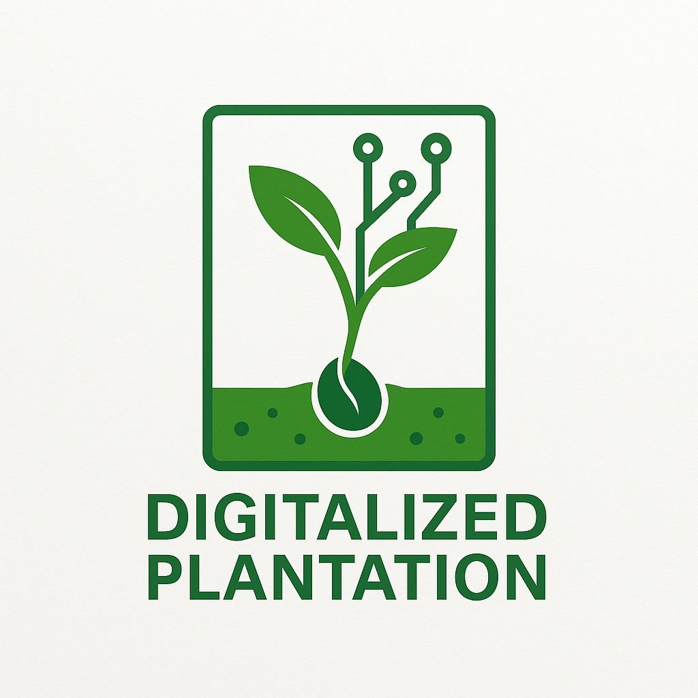

# Digitalized Plantation

A production-ready MVP plantation management platform with **Customer Dashboard**, **Internal Team Dashboard (Admin Panel)**, REST API, PostgreSQL database, web application, and mobile app (Android/iOS).



## Architecture

```
digitalized-plantation/
├── backend/          # Node.js + Express + TypeScript + Prisma REST API
├── web/              # Next.js 14 web app (Customer + Admin dashboards)
├── mobile/           # Expo React Native app (Customer dashboard)
├── packages/shared/  # Shared types and constants
├── assets/           # Brand assets (logo)
└── docker-compose.yml
```

## Tech Stack

| Layer    | Technology                                      |
|----------|-------------------------------------------------|
| Backend  | Node.js, Express, TypeScript, Prisma ORM        |
| Database | PostgreSQL 16                                   |
| Web      | Next.js 14, React, Tailwind CSS, Zustand        |
| Mobile   | Expo SDK 51, React Native, Expo Router            |
| Auth     | JWT + Refresh tokens, bcrypt password hashing     |
| Realtime | Socket.io (notifications)                       |
| Security | Helmet, CORS, rate limiting, RBAC, audit logs   |

## Features

### Customer Dashboard
- Plantation overview with health status, connected devices, alerts
- Equipment monitoring (Water Pump, Intake/Exhaust Fan, Grow Lights, Humidifier)
- Manual equipment control (ON/OFF) — enabled per-customer by admin
- Emergency notifications with priority levels and read/unread status
- Help & Support ticketing with messaging
- Profile management

### Internal Team Dashboard
- Customer management (search, activate/deactivate, manual control permissions)
- Plantation monitoring across all customers
- Centralized emergency feed with severity filters
- Support ticket management (reply, assign, close, reopen)
- Activity logs and audit trail

### Mobile App
- Full customer dashboard on Android & iOS
- Equipment monitoring and manual control
- Push-notification ready architecture
- Offline-friendly refresh patterns
- Secure token storage via Expo SecureStore

## Prerequisites

- **Node.js** 18+ and npm
- **Docker Desktop** (for PostgreSQL)
- **Expo Go** app (for mobile testing)

## Quick Start

### 1. Install dependencies

```bash
npm install
```

### 2. Start PostgreSQL

```bash
docker-compose up -d
```

### 3. Configure environment

```bash
copy backend\.env.example backend\.env
copy web\.env.example web\.env.local
copy mobile\.env.example mobile\.env
```

### 4. Initialize database

```bash
cd backend
npm run db:push
npm run db:seed
```

### 5. Start the API server

```bash
npm run dev:backend
# API runs at http://localhost:4000
```

### 6. Start the web app

```bash
npm run dev:web
# Web runs at http://localhost:3000
```

### 7. Start the mobile app

```bash
npm run dev:mobile
# Scan QR code with Expo Go
```

## Demo Credentials

| Role     | Email                                  | Password     |
|----------|----------------------------------------|--------------|
| Admin    | admin@digitalizedplantation.com        | Admin@123    |
| Support  | support@digitalizedplantation.com      | Admin@123    |
| Customer | john.green@farm.com                    | Customer@123 |

> **Note:** John Green has manual equipment control enabled. Other demo customers do not.

## API Endpoints

### Authentication
| Method | Endpoint           | Description        |
|--------|--------------------|--------------------|
| POST   | /api/auth/login    | Login              |
| POST   | /api/auth/logout   | Logout             |
| POST   | /api/auth/refresh  | Refresh token      |
| GET    | /api/auth/me       | Current user       |

### Customer
| Method | Endpoint                              | Description              |
|--------|---------------------------------------|--------------------------|
| GET    | /api/customer/dashboard               | Dashboard overview       |
| GET    | /api/customer/equipment               | Equipment list           |
| POST   | /api/customer/equipment/:id/control   | Manual control           |
| GET    | /api/customer/notifications           | Notifications            |
| GET    | /api/customer/tickets                 | Support tickets          |
| POST   | /api/customer/tickets                 | Create ticket            |

### Admin
| Method | Endpoint                                  | Description                |
|--------|-------------------------------------------|----------------------------|
| GET    | /api/admin/dashboard                      | Admin stats                |
| GET    | /api/admin/customers                      | Customer list              |
| PATCH  | /api/admin/customers/:id                  | Update customer            |
| PATCH  | /api/admin/customers/:id/manual-control   | Toggle manual control      |
| GET    | /api/admin/plantations                    | All plantations            |
| GET    | /api/admin/emergencies                    | Emergency feed             |
| GET    | /api/admin/tickets                        | All tickets                |
| GET    | /api/admin/activity-logs                  | Activity logs              |

## Database Schema

Normalized PostgreSQL schema with tables for:
- Users, Roles, Customers, Plantations
- Equipment, Equipment Logs
- Notifications, Support Tickets, Messages
- Activity Logs, Permissions, Sessions, Audit Logs
- IoT Devices (future-ready)

See `backend/prisma/schema.prisma` for the full schema.

## Branding

The UI uses colors extracted from the official Digitalized Plantation logo:

| Color            | Hex       | Usage                          |
|------------------|-----------|--------------------------------|
| Primary Green    | `#1B5E20` | Sidebar, headers, buttons      |
| Primary Light    | `#2E7D32` | Hover states, gradients        |
| Secondary Green  | `#388E3C` | Accents                        |
| Accent Green     | `#4CAF50` | Online status, success states  |
| Background       | `#F8F9FA` | Page background                |

## Security

- bcrypt password hashing (12 rounds)
- JWT access + refresh token sessions
- Role-based access control (CUSTOMER, SUPPORT, ADMIN, SUPER_ADMIN)
- Rate limiting (100 req/15min)
- Helmet security headers
- Input validation with Zod
- SQL injection prevention via Prisma ORM
- Activity and audit logging

## Future Scalability

The modular architecture supports future additions:
- AI recommendations and analytics
- IoT sensor integration (IoTDevice table ready)
- Weather forecasting APIs
- Firebase Cloud Messaging / APNS push notifications
- Multiple plantations per customer
- Multi-language support
- PDF reports and email/SMS notifications

## License

Proprietary — Digitalized Plantation © 2026
